- [概述](#概述)
- [消息队列](#消息队列)
  - [应用场景](#应用场景)
  - [好处](#好处)
  - [消费模式](#消费模式)
    - [点对点模式（一对一，消费者主动拉取数据，消息收到后消息清除）](#点对点模式一对一消费者主动拉取数据消息收到后消息清除)
    - [发布/订阅模式（一对多，消费者消费数据之后不会清除消息）](#发布订阅模式一对多消费者消费数据之后不会清除消息)
- [kafka基本架构](#kafka基本架构)
  - [入门\_安装\_启动_关闭](#入门_安装_启动_关闭)
- [Kafka架构深入](#kafka架构深入)
  - [工作流程](#工作流程)
  - [文件存储](#文件存储)
- [生产者](#生产者)
  - [分区策略](#分区策略)
  - [数据可靠性保证](#数据可靠性保证)
  - [Exactly Once （精准一致性）语义](#exactly-once-精准一致性语义)
- [消费者](#消费者)
  - [消费方式](#消费方式)
  - [分区分配策略](#分区分配策略)
    - [RoundRobin](#roundrobin)
    - [Range](#range)
    - [Sticky](#sticky)
  - [offset的维护](#offset的维护)
  - [消费者组案例](#消费者组案例)
- [高效数据读写](#高效数据读写)
  - [顺序写磁盘](#顺序写磁盘)
  - [零拷贝技术](#零拷贝技术)
- [Zookeeper 在 Kafka 中的作用](#zookeeper-在-kafka-中的作用)
- [kafka事务](#kafka事务)
  - [Producer事务](#producer事务)
  - [Consumer事务](#consumer事务)
- [Kafka API](#kafka-api)
  - [Producer API](#producer-api)
    - [消息发送流程](#消息发送流程)
  - [Customer API](#customer-api)
  - [Interceptor](#interceptor)
- [Kafka监控](#kafka监控)
- [常见问题](#常见问题)


### 概述

- Kafka 是一个**分布式**的基于**发布/订阅模式**的**消息队列**，由Scala写成，主要应用于大数据实时处理领域。

### 消息队列

#### 应用场景


#### 好处

1. **解耦**

   允许你独立的扩展或修改两边的处理过程，只要确保它们遵守同样的接口约束。

2. **削峰**

   在访问量剧增的情况下，应用仍然需要继续发挥作用，但是这样的突发流量并不常见。如果为以能处理这类峰值访问为标准来投入资源随时待命无疑是巨大的浪费。使用消息队列能够使关键组件顶住突发的访问压力，而不会因为突发的超负荷的请求而完全崩溃。

3. **异步**

   很多时候，用户不想也不需要立即处理消息。消息队列提供了异步处理机制，允许用户把一个消息放入队列，但并不立即处理它。想向队列中放入多少消息就放多少，然后在需要的时候再去处理它们。

4. 缓冲

   有助于控制和优化数据流经过系统的速度， 解决生产消息和消费消息的处理速度不一致的情况。

5. 可恢复性

   系统的一部分组件失效时，不会影响到整个系统。消息队列降低了进程间的耦合度，所以即使一个处理消息的进程挂掉，加入队列中的消息仍然可以在系统恢复后被处理

#### 消费模式

##### 点对点模式（一对一，消费者主动拉取数据，消息收到后消息清除）

- 消息生产者生产消息发送到Queue中，然后消息消费者从Queue中取出并且消费消息。 消息被消费以后，queue 中不再有存储，所以消息消费者不可能消费到已经被消费的消息。 Queue 支持存在多个消费者，但是对一个消息而言，只会有一个消费者可以消费。

  


##### 发布/订阅模式（一对多，消费者消费数据之后不会清除消息）

- 消息生产者（发布）将消息发布到 topic 中，同时有多个消息消费者（订阅）消费该消 息。和点对点方式不同，发布到 topic 的消息会被所有订阅者消费。

  


### kafka基本架构


- 相关概念
  1. **Producer**：消息生产者，就是向 Kafka broker发送消息；
  2. **Consumer**：消息消费者，向 Kafka broker 取消息的客户端；
  3. **Consumer Group （CG）**：消费者组，由多个 consumer 组成。 消费者组内每个消费者负责消费不同分区的数据，一个分区只能由一个组内消费者消费；消费者组之间互不影响。 所有的消费者都属于某个消费者组，即消费者组是逻辑上的一个订阅者。
  4. **Broker**：一台 Kafka 服务器就是一个 broker。一个集群由多个 broker 组成。**一个 broker可以容纳多个 partition**。
  5. **Topic**：话题，可以理解为一个队列， 生产者和消费者面向的都是一个 topic，**相当于把消息分类**，根据topic来分类。
  6. **Partition**：为了实现扩展性，一个**topic 可以分为多个 partition**，每个 partition 是一个有序的队列；
  7. **Replica**：副本（Replication），为保证集群中的某个节点发生故障时， 该节点上的 partition 数据不丢失，且 Kafka仍然能够继续工作， Kafka 提供了副本机制，一个 topic 的每个分区都有若干个副本，一个 leader 和若干个 follower(副本数是leader数与follower数之和，不只是follower数之和)。
  8. **Leader**：每个分区多个副本的“主”，生产者发送数据的对象，以及消费者消费数据的对象都是 leader。
  9. **Follower**：每个分区多个副本中的“从”，实时从 leader 中同步数据，保持和 leader 数据的同步。**leader 发生故障时，某个 Follower 会成为新的 leader**。

#### 入门\_安装\_启动_关闭

- [下载](http://kafka.apache.org/downloads.html)并解压

  ```shell
  # 2.11是scala版本，0.11.0.2是kafka版本
  tar -zxvf kafka_2.11-0.11.0.2.tgz -C /home/kafka/
  ```

- 创建日志目录

  ```shell
  mkdir -p /home/kafka/kafka_2.11-0.11.0.2/logs
  ```

- 修改配置文件

  ```shell
  vi /home/kafka/kafka_2.11-0.11.0.2/config/server.properties
  ```

  完整内容如下：

  ```properties
  # Licensed to the Apache Software Foundation (ASF) under one or more
  # contributor license agreements.  See the NOTICE file distributed with
  # this work for additional information regarding copyright ownership.
  # The ASF licenses this file to You under the Apache License, Version 2.0
  # (the "License"); you may not use this file except in compliance with
  # the License.  You may obtain a copy of the License at
  #
  #    http://www.apache.org/licenses/LICENSE-2.0
  #
  # Unless required by applicable law or agreed to in writing, software
  # distributed under the License is distributed on an "AS IS" BASIS,
  # WITHOUT WARRANTIES OR CONDITIONS OF ANY KIND, either express or implied.
  # See the License for the specific language governing permissions and
  # limitations under the License.
  
  # see kafka.server.KafkaConfig for additional details and defaults
  
  ############################# Server Basics #############################
  
  # The id of the broker. This must be set to a unique integer for each broker.
  #broker的全局唯一编号，不能重复
  broker.id=0
  
  # Switch to enable topic deletion or not, default value is false
  #删除topic功能使能
  delete.topic.enable=true
  
  ############################# Socket Server Settings #############################
  
  # The address the socket server listens on. It will get the value returned from 
  # java.net.InetAddress.getCanonicalHostName() if not configured.
  #   FORMAT:
  #     listeners = listener_name://host_name:port
  #   EXAMPLE:
  #     listeners = PLAINTEXT://your.host.name:9092
  #listeners=PLAINTEXT://:9092
  
  # Hostname and port the broker will advertise to producers and consumers. If not set, 
  # it uses the value for "listeners" if configured.  Otherwise, it will use the value
  # returned from java.net.InetAddress.getCanonicalHostName().
  #advertised.listeners=PLAINTEXT://your.host.name:9092
  
  # Maps listener names to security protocols, the default is for them to be the same. See the config documentation for more details
  #listener.security.protocol.map=PLAINTEXT:PLAINTEXT,SSL:SSL,SASL_PLAINTEXT:SASL_PLAINTEXT,SASL_SSL:SASL_SSL
  
  # The number of threads that the server uses for receiving requests from the network and sending responses to the network
  #处理网络请求的线程数量
  num.network.threads=3
  
  # The number of threads that the server uses for processing requests, which may include disk I/O
  #用来处理磁盘IO的现成数量
  num.io.threads=8
  
  # The send buffer (SO_SNDBUF) used by the socket server
  #发送套接字的缓冲区大小
  socket.send.buffer.bytes=102400
  
  # The receive buffer (SO_RCVBUF) used by the socket server
  #接收套接字的缓冲区大小
  socket.receive.buffer.bytes=102400
  
  # The maximum size of a request that the socket server will accept (protection against OOM)
  #请求套接字的缓冲区大小
  socket.request.max.bytes=104857600
  
  
  ############################# Log Basics #############################
  
  # A comma seperated list of directories under which to store log files
  #kafka运行日志存放的路径
  log.dirs=/home/kafka/kafka_2.11-0.11.0.2/logs
  
  # The default number of log partitions per topic. More partitions allow greater
  # parallelism for consumption, but this will also result in more files across
  # the brokers.
  #topic在当前broker上的分区个数
  num.partitions=1
  
  # The number of threads per data directory to be used for log recovery at startup and flushing at shutdown.
  # This value is recommended to be increased for installations with data dirs located in RAID array.
  #用来恢复和清理data下数据的线程数量
  num.recovery.threads.per.data.dir=1
  
  ############################# Internal Topic Settings  #############################
  # The replication factor for the group metadata internal topics "__consumer_offsets" and "__transaction_state"
  # For anything other than development testing, a value greater than 1 is recommended for to ensure availability such as 3.
  offsets.topic.replication.factor=1
  transaction.state.log.replication.factor=1
  transaction.state.log.min.isr=1
  
  ############################# Log Flush Policy #############################
  
  # Messages are immediately written to the filesystem but by default we only fsync() to sync
  # the OS cache lazily. The following configurations control the flush of data to disk.
  # There are a few important trade-offs here:
  #    1. Durability: Unflushed data may be lost if you are not using replication.
  #    2. Latency: Very large flush intervals may lead to latency spikes when the flush does occur as there will be a lot of data to flush.
  #    3. Throughput: The flush is generally the most expensive operation, and a small flush interval may lead to exceessive seeks.
  # The settings below allow one to configure the flush policy to flush data after a period of time or
  # every N messages (or both). This can be done globally and overridden on a per-topic basis.
  
  # The number of messages to accept before forcing a flush of data to disk
  #segment文件保留的最长时间，超时将被删除
  log.flush.interval.messages=10000
  
  # The maximum amount of time a message can sit in a log before we force a flush
  #log.flush.interval.ms=1000
  
  ############################# Log Retention Policy #############################
  
  # The following configurations control the disposal of log segments. The policy can
  # be set to delete segments after a period of time, or after a given size has accumulated.
  # A segment will be deleted whenever *either* of these criteria are met. Deletion always happens
  # from the end of the log.
  
  # The minimum age of a log file to be eligible for deletion due to age
  log.retention.hours=168
  
  # A size-based retention policy for logs. Segments are pruned from the log as long as the remaining
  # segments don't drop below log.retention.bytes. Functions independently of log.retention.hours.
  #log.retention.bytes=1073741824
  
  # The maximum size of a log segment file. When this size is reached a new log segment will be created.
  log.segment.bytes=1073741824
  
  # The interval at which log segments are checked to see if they can be deleted according
  # to the retention policies
  log.retention.check.interval.ms=300000
  
  ############################# Zookeeper #############################
  
  # Zookeeper connection string (see zookeeper docs for details).
  # This is a comma separated host:port pairs, each corresponding to a zk
  # server. e.g. "127.0.0.1:3000,127.0.0.1:3001,127.0.0.1:3002".
  # You can also append an optional chroot string to the urls to specify the
  # root directory for all kafka znodes.
  #配置连接Zookeeper集群地址
  zookeeper.connect=localhost:2181
  
  # Timeout in ms for connecting to zookeeper
  zookeeper.connection.timeout.ms=6000
  
  
  ############################# Group Coordinator Settings #############################
  
  # The following configuration specifies the time, in milliseconds, that the GroupCoordinator will delay the initial consumer rebalance.
  # The rebalance will be further delayed by the value of group.initial.rebalance.delay.ms as new members join the group, up to a maximum of max.poll.interval.ms.
  # The default value for this is 3 seconds.
  # We override this to 0 here as it makes for a better out-of-the-box experience for development and testing.
  # However, in production environments the default value of 3 seconds is more suitable as this will help to avoid unnecessary, and potentially expensive, rebalances during application startup.
  group.initial.rebalance.delay.ms=0
  ```

- 配置环境变量

  ```shell
  vi /etc/profile
  #添加
  #KAFKA
  export KAFKA_HOME=/home/kafka/kafka_2.11-0.11.0.2
  export PATH=$PATH:$KAFKA_HOME/bin
  ```

- 配置文件生效

  ```shell
  source /etc/profile
  ```

### Kafka架构深入

#### 工作流程


- 如上图，一个topic分了三个分区，每个分区两个副本(leader + follower一共两个，不是两个follower)，同一个分区的leader和follower不在同一台机器上(在同一台机器上就没意义了)，follower会同步leader上的数据。
- 生产者往分区发消息时会记录偏移量(offset)，不同分区间的偏移量互不影响，消费者找leader消费消息时会记录消息的offset
- Kafka 中消息是以 topic 进行分类的， producer生产消息，consumer消费消息，都是面向 topic的。
- **topic 是逻辑上的概念，partition 是物理上的概念，每个 partition 对应于一个 log 文件**，该 log 文件中存储的就是 producer 生产的数据。（topic = N partition，partition = log）

- Producer 生产的数据会被不断追加到该log 文件末端，且每条数据都有自己的 offset。 consumer组中的每个consumer， 都会实时记录自己消费到了哪个 offset，以便出错恢复时，从上次的位置继续消费。

#### 文件存储

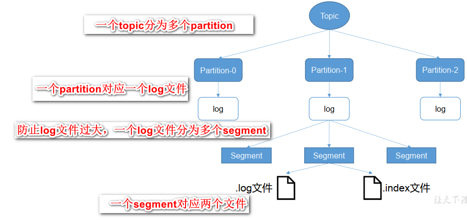

- 由于生产者生产的消息会不断追加到 log 文件末尾，为防止 log 文件过大导致数据定位效率低下，Kafka 采取了**分片和索引机制**，将每个 partition 分为多个 segment。每个 segment 对应两个文件——“.index”文件和“.log”文件。这些文件位于一个文件夹下，该文件夹的命名 规则为：topic 名称+分区序号。例如，first 这个 topic 有三个分区，则其对应的文件夹为 first-0,first-1,first-2。

  ```
  00000000000000000000.index
  00000000000000000000.log
  00000000000000170410.index
  00000000000000170410.log
  00000000000000239430.index
  00000000000000239430.log
  ```

- index 和 log 文件以当前 segment 的第一条消息的 offset 命名。下图为 index 文件和 log 文件的结构示意图。

  
  - **“.index”文件存储大量的索引信息，“.log”文件存储大量的数据**，索引文件中的元数据指向对应数据文件中 message 的物理偏移地址。
  - 根据文件名，二分查找到offset所在的index文件，index文件中每条数据大小都一样，这样就可以快速定位到要找的offset，找到offset后，根据index记录的message大小，物理偏移地址等信息，就可以快速定位到数据文件(log)中的具体数据。比直接扫描数据文件(log文件)快得多

### 生产者

#### 分区策略

- 分区原因

  - **方便在集群中扩展，提高负载能力**，每个 Partition 可以通过调整以适应它所在的机器，而一个 topic 又可以有多个 Partition 组成，因此整个集群就可以适应任意大小的数据了；
  - **可以提高并发**，因为可以以 Partition 为单位读写了。

- 分区的原则

  

  1. 指明 partition 的情况下，直接将指明的值直接作为 partiton 值；
  2. 没有指明 partition 值但有 key 的情况下，将 key 的 hash 值与 topic 的 partition 数进行取余得到 partition 值；
  3. 既没有 partition 值又没有 key 值的情况下，第一次调用时随机生成一个整数（后面每次调用在这个整数上自增），将这个值与 topic 可用的 partition 总数取余得到 partition值，也就是常说的 round-robin 算法。

#### 数据可靠性保证

- 为保证 producer 发送的数据，能可靠的发送到指定的 topic，topic 的每个 partition 收到 producer 发送的数据后，都需要向 producer 发送 ack（acknowledgement 确认收到），如果 producer 收到 ack，就会进行下一轮的发送，否则重新发送数据。

  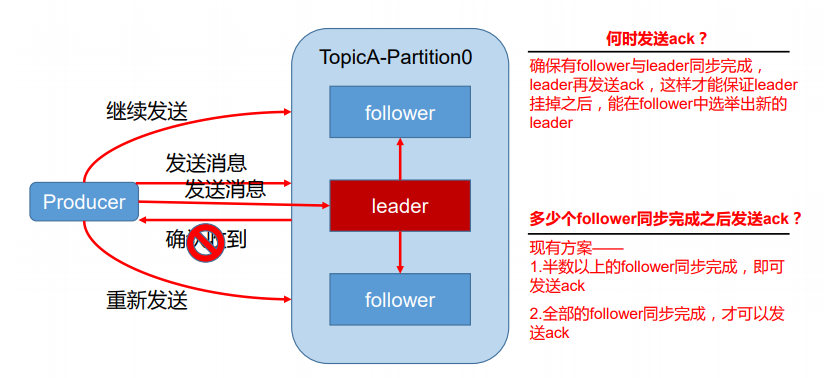

| 序号 | 方案                          | 优点                                                       | 缺点                                                        |
| ---- | ----------------------------- | ---------------------------------------------------------- | ----------------------------------------------------------- |
| 1    | 半数以上完成同步， 就发送 ack | 延迟低                                                     | 选举新的 leader 时，容忍 n 台 节点的故障，需要 2n+1 个副 本 |
| 2    | 全部完成同步，才发送ack       | 选举新的 leader 时，容忍 n 台 节点的故障，需要 n+1 个副 本 | 延迟高                                                      |

- Kafka 选择了第二种方案，原因如下：

  1. 同样为了容忍 n 台节点的故障，第一种方案需要 2n+1 个副本，而第二种方案只需要 n+1 个副本，而 Kafka 的每个分区都有大量的数据， 第一种方案会造成大量数据的冗余。

  2. 虽然第二种方案的网络延迟会比较高，但网络延迟对 Kafka 的影响较小。

- ISR

  - 采用第二种方案之后，设想以下情景： leader 收到数据，所有 follower 都开始同步数据，但有一个 follower，因为某种故障，迟迟不能与 leader 进行同步，那 leader 就要一直等下去，直到它完成同步，才能发送 ack。这个问题怎么解决呢？
  - **Leader 维护了一个动态的in-sync replica set (ISR)，意为和 leader 保持同步的 follower 集合。当 ISR 中的 follower 完成数据的同步之后，就会给 leader 发送 ack。如果 follower长时间未向leader同步数据，则该follower将被踢出ISR，该时间阈值由`replica.lag.time.max.ms`参数设定。 Leader 发生故障之后，就会从 ISR 中选举新的 leader**。

- ack应答机制

  - 对于某些不太重要的数据，对数据的可靠性要求不是很高，能够容忍数据的少量丢失，所以没必要等 ISR 中的 follower 全部接收成功。
  - 所以 Kafka 为用户提供了三种可靠性级别，用户根据对可靠性和延迟的要求进行权衡，选择以下的配置。
  - **acks 参数配置**：
    - 0：producer 不等待 leader的 ack，这一操作提供了一个最低的延迟， leader一接收到还没有写入磁盘就已经返回，当leader故障时有可能**丢失数据**；
    - 1：producer 等待 leader的 ack， partition 的 leader 落盘成功后返回 ack，不等follower同步成功，如果在 follower同步成功之前 leader 故障，那么将会**丢失数据**；
    - -1（all）： producer 等待 leader的 ack， partition 的 leader 和 ISR 的follower 全部落盘成功后才返回 ack。但是如果在 follower 同步完成后， leader发送 ack 之前， leader发生故障，那么producer就不会受到ack，就会重新发送数据，就会造成新leader这边**数据重复**。

- 数据一致性问题

  - 假设某个partition有3个副本(一个leader，两个follower)，leader中有10条数据，offset为9，一个follower同步了8条数据，offset为7，另外一个follower同步了9条数据，offset为8，如果此时leader挂了。那么这两个follower都有选举为leader的可能。并且不同follower选举为leader之后，消费者根据offset消息的消息是不同的，如此，数据消费的offset就紊乱了。

  - 为此，kafka引入两个概念：**LEO**(Log End Offset)：**指的是每个副本最大的 offset**；**HW**(High Watermark，高水位)，**指的是所有副本中最小的LEO**，消费者能见到的最大的 offset，ISR 队列中最小的 LEO。

    

- follower和leader故障
  - **follower 故障**：follower 发生故障后会被临时踢出 ISR，待该 follower 恢复后， follower 会读取本地磁盘记录的上次的 HW，并将 log 文件高于 HW 的部分截取掉，从 HW 开始向 leader 进行同步。等该 follower 的 LEO 大于等于该 Partition 的 HW，即 follower 追上 leader 之后，就可以重新加入 ISR 了。
  - **leader 故障**：leader 发生故障之后，会从 ISR 中选出一个新的 leader，之后，为保证多个副本之间的数据一致性， 其余的 follower 会先将各自的 log 文件高于 HW 的部分截掉，然后从新的 leader同步数据。
  - 注意：这只能保证副本之间的数据一致性，并不能保证数据不丢失或者不重复。

#### Exactly Once （精准一致性）语义

- 将服务器的 ACK 级别设置为-1，可以保证 Producer 到 Server 之间不会丢失数据，即 **At Least Once** 语义。
- 相对的，将服务器 ACK 级别设置为 0，可以保证生产者每条消息只会被 发送一次，即 **At Most Once** 语义。
- At Least Once 可以保证数据不丢失，但是不能保证数据不重复；相对的，At Least Once 可以保证数据不重复，但是不能保证数据不丢失。**但是，对于一些非常重要的信息，比如说交易数据，下游数据消费者要求数据既不重复也不丢失，即 Exactly Once 语义**。在 0.11 版 本以前的 Kafka，对此是无能为力的，只能保证数据不丢失，再在下游消费者对数据做全局 去重。对于多个下游应用的情况，每个都需要单独做全局去重，这就对性能造成了很大影响。
- 0.11 版本的 Kafka，引入了一项重大特性：**幂等性**。所谓的幂等性就是指**Producer 不论向 Server 发送多少次重复数据，Server 端都只会持久化一条**。幂等性结合 At Least Once 语 义，就构成了 Kafka 的 Exactly Once 语义。即：**At Least Once + 幂等性 = Exactly Once**。
- 要启用幂等性，只需要将 Producer 的参数中`enable.idompotence`设置为 true 即可。Kafka 的幂等性实现其实就是将原来下游需要做的去重放在了数据上游。**开启幂等性的 Producer 在初始化的时候会被分配一个 PID，发往同一Partition的消息会附带 Sequence Number。而 Broker端会对做缓存，当具有相同主键的消息提交时，Broker只会持久化一条。**
- 但是 PID 重启就会变化，同时不同的 Partition也具有不同主键，所以幂等性无法保证跨分区跨会话的 Exactly Once，只能保证单个分区单次会话的Exactly Once。

### 消费者

#### 消费方式

- consumer采用pull（拉）模式从broker中读取数据。
- push（推）模式很难适应消费速率不同的消费者，因为消息发送速率是由 broker 决定的。 它的目标是尽可能以最快速度传递消息，但是这样很容易造成 consumer 来不及处理消息，典型的表现就是拒绝服务以及网络拥塞。而 pull 模式则可以根据 consumer 的消费能力以适当的速率消费消息。
- pull 模式不足之处是，如果 kafka 没有数据，消费者可能会陷入循环中，一直返回空数据。针对这一点，Kafka 的消费者在消费数据时会传入一个时长参数 timeout，如果当前没有数据可供消费，consumer 会等待一段时间之后再返回，这段时长即为 timeout。

#### 分区分配策略

- 一个 consumer group 中有多个 consumer，一个 topic 有多个 partition，所以必然会涉及到 partition 的分配问题，即确定哪个 partition 由哪个 consumer 来消费。Kafka 有两种分配策略，一个是`RoundRobin`，另一是`Range`。新版本新增了`Sticky`策略。

##### RoundRobin

- 会采用轮询的方式将当前所有的分区依次分配给所有的consumer

- 关于`Roudn Robin`重分配策略，其主要采用的是一种轮询的方式分配所有的分区，该策略主要实现的步骤如下。这里我们首先假设有三个topic：t0、t1和t2，这三个topic拥有的分区数分别为1、2和3，那么总共有六个分区，这六个分区分别为：t0-0、t1-0、t1-1、t2-0、t2-1和t2-2。这里假设我们有三个consumer：C0、C1和C2，它们订阅情况为：C0订阅t0，C1订阅t0和t1，C2订阅t0、t1和t2。那么这些分区的分配步骤如下：

  - 首先将所有的partition和consumer按照字典序进行排序，所谓的字典序，就是按照其名称的字符串顺序，那么上面的六个分区和三个consumer排序之后分别为：

    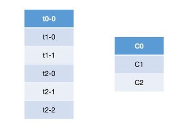

  - 然后依次以按顺序轮询的方式将这六个分区分配给三个consumer，如果当前consumer没有订阅当前分区所在的topic，则轮询的判断下一个consumer：

  - 尝试将t0-0分配给C0，由于C0订阅了t0，因而可以分配成功；

  - 尝试将t1-0分配给C1，由于C1订阅了t1，因而可以分配成功；

  - 尝试将t1-1分配给C2，由于C2订阅了t1，因而可以分配成功；

  - 尝试将t2-0分配给C0，由于C0没有订阅t2，因而会轮询下一个consumer；

  - 尝试将t2-0分配给C1，由于C1没有订阅t2，因而会轮询下一个consumer；

  - 尝试将t2-0分配给C2，由于C2订阅了t2，因而可以分配成功；

  - 同理由于t2-1和t2-2所在的topic都没有被C0和C1所订阅，因而都不会分配成功，最终都会分配给C2。

  - 按照上述的步骤将所有的分区都分配完毕之后，最终分区的订阅情况如下：

    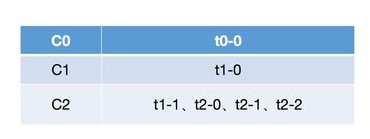

- 从上面的步骤分析可以看出，轮询的策略就是简单的将所有的partition和consumer按照字典序进行排序之后，然后依次将partition分配给各个consumer，如果当前的consumer没有订阅当前的partition，那么就会轮询下一个consumer，直至最终将所有的分区都分配完毕。但是从上面的分配结果可以看出，轮询的方式会导致每个consumer所承载的分区数量不一致，从而导致各个consumer压力不均一。

##### Range

- 首先会计算每个consumer可以消费的分区个数，然后按照顺序将指定个数范围的分区分配给各个consumer；

- 所谓的`Range`重分配策略，就是首先会计算各个consumer将会承载的分区数量，然后将指定数量的分区分配给该consumer。这里我们假设有两个consumer：C0和C1，两个topic：t0和t1，这两个topic分别都有三个分区，那么总共的分区有六个：t0-0、t0-1、t0-2、t1-0、t1-1和t1-2。那么`Range`分配策略将会按照如下步骤进行分区的分配：

  - 需要注意的是，`Range`策略是按照topic依次进行分配的，比如我们以t0进行讲解，其首先会获取t0的所有分区：t0-0、t0-1和t0-2，以及所有订阅了该topic的consumer：C0和C1，并且会将这些分区和consumer按照字典序进行排序；
  - 然后按照平均分配的方式计算每个consumer会得到多少个分区，如果没有除尽，则会将多出来的分区依次计算到前面几个consumer。比如这里是三个分区和两个consumer，那么每个consumer至少会得到1个分区，而3除以2后还余1，那么就会将多余的部分依次算到前面几个consumer，也就是这里的1会分配给第一个consumer，总结来说，那么C0将会从第0个分区开始，分配2个分区，而C1将会从第2个分区开始，分配1个分区；
  - 同理，按照上面的步骤依次进行后面的topic的分配。
  - 最终上面六个分区的分配情况如下：

  ​		

- 可以看到，如果按照`Range`分区方式进行分配，其本质上是依次遍历每个topic，然后将这些topic的分区按照其所订阅的consumer数量进行平均的范围分配。这种方式从计算原理上就会导致排序在前面的consumer分配到更多的分区，从而导致各个consumer的压力不均衡。

##### Sticky

- 这种分区策略是最新版本中新增的一种策略，其主要实现了两个目的：

  - 将现有的分区尽可能均衡的分配给各个consumer，存在此目的的原因在于`Round Robin`和`Range`分配策略实际上都会导致某几个consumer承载过多的分区，从而导致消费压力不均衡；
  - 如果发生再平衡，那么重新分配之后在前一点的基础上会尽力保证当前未宕机的consumer所消费的分区不会被分配给其他的consumer上；

- `Sticky`策略是新版本中新增的策略，顾名思义，这种策略会保证再分配时已经分配过的分区尽量保证其能够继续由当前正在消费的consumer继续消费，当然，前提是每个consumer所分配的分区数量都大致相同，这样能够保证每个consumer消费压力比较均衡。关于这种分配方式的分配策略，我们分两种情况进行讲解，即**初始状态的分配**和**某个consumer宕机时的分配**情况。

- 初始分配

  - 初始状态分配的特点是，所有的分区都还未分配到任意一个consumer上。这里我们假设有三个consumer：C0、C1和C2，三个topic：t0、t1和t2，这三个topic分别有1、2和3个分区，那么总共的分区为：t0-0、t1-0、t1-1、t2-0、t2-1和t2-2。关于订阅情况，这里C0订阅了t0，C1订阅了t0和t1，C2则订阅了t0、t1和t2。这里的分区分配规则如下：

    - 首先将所有的分区进行排序，排序方式为：首先按照当前分区所分配的consumer数量从低到高进行排序，如果consumer数量相同，则按照分区的字典序进行排序。这里六个分区由于所在的topic的订阅情况各不相同，因而其排序结果如下：

      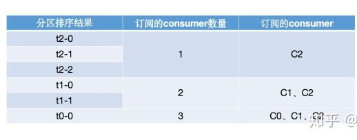

    - 然后将所有的consumer进行排序，其排序方式为：首先按照当前consumer已经分配的分区数量由小到大排序，如果两个consumer分配的分区数量相同，则会按照其名称的字典序进行排序。由于初始时，这三个consumer都没有分配任何分区，因而其排序结果即为其按照字典序进行排序的结果：

      

    - 然后将各个分区依次遍历分配给各个consumer，首先需要注意的是，这里的遍历并不是C0分配完了再分配给C1，而是每次分配分区的时候都整个的对所有的consumer从头开始遍历分配，如果当前consumer没有订阅当前分区，则会遍历下一个consumer。然后需要注意的是，在整个分配的过程中，各个consumer所分配的分区数是动态变化的，而这种变化是会体现在各个consumer的排序上的，比如初始时C0是排在第一个的，此时如果分配了一个分区给C0，那么C0就会排到最后，因为其拥有的分区数是最多的。上面的六个分区整体的分配流程如下：

    - 首先将t2-0尝试分配给C0，由于C0没有订阅t2，因而分配不成功，继续轮询下一个consumer；

    - 然后将t2-0尝试分配给C1，由于C1没有订阅t2，因而分配不成功，继续轮询下一个consumer；

    - 接着将t2-0尝试分配给C2，由于C2订阅了t2，因而分配成功，此时由于C2分配的分区数发生变化，各个consumer变更后的排序结果为：

      

    - 接下来的t2-1和t2-2，由于也只有C2订阅了t2，因而其最终还是会分配给C2，最终在t2-0、t2-1和t2-2分配完之后，各个consumer的排序以及其分区分配情况如下：

      

    - 接着继续分配t1-0，首先尝试将其分配给C0，由于C0没有订阅t1，因而分配不成功，继续轮询下一个consumer；

    - 然后尝试将t1-0分配给C1，由于C1订阅了t1，因而分配成功，此时各个consumer以及其分配的分区情况如下：

      

    - 同理，接下来会分配t1-1，虽然C1和C2都订阅了t1，但是由于C1排在C2前面，因而该分区会分配给C1，即：

      

    - 最后，尝试将t0-0分配给C0，由于C0订阅了t0，因而分配成功，最终的分配结果为：

      

  - 上面的分配过程中，需要始终注意的是，虽然示例中的consumer顺序始终没有变化，但这是由于各个分区分配之后正好每个consumer所分配的分区数量的排序结果与初始状态一致。这里读者也可以比较一下这种分配方式与前面讲解的`Round Robin`进行对比，可以很明显的发现，`Sticky`重分配策略分配得更加均匀一些。

- 模拟Consumer宕机

  - 由于前一个示例中最终的分区分配方式模拟宕机的情形比较简单，因而我们使用另一种订阅策略。这里我们的示例的consumer有三个：C0、C1和C2，topic有四个：t0、t1、t2和t3，每个topic都有两个分区，那么总的分区有：t0-0、t0-1、t1-0、t1-1、t2-0、t2-1、t3-0和t3-1。这里的订阅情况为三个consumer订阅所有的主题，那么如果按照`Sticky`的分区分配策略，初始状态时，分配情况如下，可以按照前一示例讲解的方式进行推算：

    

  - 这里我们假设在消费的过程中，C1发生了宕机，此时就会发生再平衡，而根据`Sticky`策略，其再分配步骤如下：

    - 首先会将宕机之后未分配的分区进行排序，排序方式为：首先按照分区所拥有的consumer数量从低到高进行排序，如果consumer数量相同，则按照分区的字典序进行排序。这里需要注意的是，由于只有C1宕机，因而未分配的分区为：t0-1、t2-0和t3-1，排序之后的结果为：

      

    - 然后将所有的consumer进行排序，排序方式为：首先将consumer按照其所拥有的consumer数量从小到大排序，如果数量相同，则按照consumer名称的字典序进行排序，排序结果如下：

      

    - 接着依次遍历各个分区，将其分配给各个consumer，需要注意的是，在分配的过程中，consumer所分配的分区数量是在变化的，而这种变化是会反应在consumer的排序上的：

    - 首先尝试将t0-1分配给C2，由于C2订阅了t0，因而可以分配成功，此时consumer排序和分区分配情况如下，需要注意的是，虽然分配之后，C2和C0的分区数量相同，但是由于按照字典序，C0在C2前面，因而排序情况还是会发生变化：

      

    - 然后尝试将t2-0分配给C0，由于C0订阅了t2，因而分配可以成功，此时consumer排序和分区分配情况如下：

      

    - 最后尝试分配t3-1给C2，由于C2订阅了t3，因而分配可以成功，此时consumer排序与分区分配情况如下：

      

  - 在上面的分区分配过程中，我们可以看到，由于分区的不断分配，各个consumer所拥有的分区数量也在不断变化，因而其排序情况也在变化，但是最终可以看到，各个分区是均匀的分配到各个consumer的，并且还保证了当前consumer已经消费的分区是不会分配到其他的consumer上的。

#### offset的维护

- 由于 consumer 在消费过程中可能会出现断电宕机等故障，consumer 恢复后，需要从故障前的位置的继续消费，所以 consumer 需要实时记录自己消费到了哪个 offset，以便故障恢复后继续消费。

- topic + partition + consumer group（不是consumer，是consumer group）唯一确定一个offset

  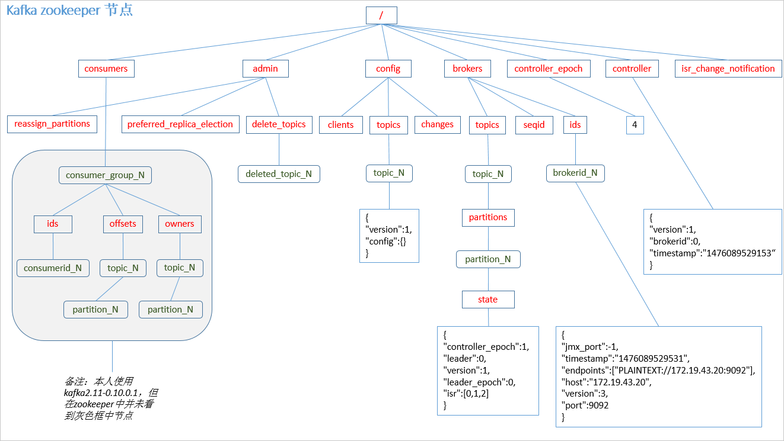

- **Kafka 0.9 版本之前， consumer 默认将 offset 保存在 Zookeeper 中，从 0.9 版本开始，consumer 默认将 offset 保存在 Kafka 一个内置的 topic 中，该 topic 为`__consumer_offsets`**。

  1. 修改配置文件`consumer.properties`，`exclude.internal.topics=false`。

  2. 读取offset

     - 0.11.0.0 之前版本：

       ```shell
       bin/kafka-console-consumer.sh 
       --topic __consumer_offsets 
       --zookeeper hadoop102:2181 
       --formatter "kafka.coordinator.GroupMetadataManager\$OffsetsMessageFormatter" 
       --consumer.config config/consumer.properties --from-beginning
       ```

     - 0.11.0.0 及之后版本：

       ```shell
       bin/kafka-console-consumer.sh 
       --topic __consumer_offsets 
       --zookeeper hadoop102:2181 
       --formatter "kafka.coordinator.group.GroupMetadataManager\$OffsetsMessageFormatter" 
       --consumer.config config/consumer.properties --from-beginning
       ```

#### 消费者组案例

- 需求：测试同一个消费者组中的消费者，同一时刻只能有一个消费者消费。

- 案例实操

  - 在 hadoop102、hadoop103两台机器上修改`/opt/module/kafka/config/consumer.properties`配置 文件中的 group.id 属性为任意组名。

    ```shell
    [atguigu@hadoop103 config]$ vi consumer.properties
    group.id=andios
    
    [atguigu@hadoop102 config]$ vi consumer.properties
    group.id=andios
    ```

  - 在 hadoop102、hadoop103 上分别启动消费者

    ```shell
    [atguigu@hadoop102 kafka]$ bin/kafka-console-consumer.sh 
    --zookeeper hadoop102:2181 
    --topic first 
    --consumer.config config/consumer.properties
    
    [atguigu@hadoop103 kafka]$ bin/kafka-console-consumer.sh 
    --zookeeper hadoop102:2181
    --topic first 
    --consumer.config config/consumer.properties
    ```

  - 在 hadoop104 上启动生产者

    ```shell
    [atguigu@hadoop104 kafka]$ bin/kafka-console-producer.sh 
    --broker-list hadoop104:9092 
    --topic first
    
    >hello world
    ```

  - 查看 hadoop102 和 hadoop103 的接收者。同一时刻只有一个消费者接收到消息。

  - 如果hadoop102 和 hadoop103配置文件中的`group.id`不同，那么hadoop104发消息，102和103都能收到

### 高效数据读写

#### 顺序写磁盘

- Kafka 的 producer 生产数据，要写入到 log 文件中，写的过程是一直追加到文件末端， 为顺序写。官网有数据表明，同样的磁盘，顺序写能到 600M/s，而随机写只有 100K/s。这与磁盘的机械机构有关，顺序写之所以快，是因为其省去了大量磁头寻址的时间

#### 零拷贝技术

- NIC network interface controller 网络接口控制器

​	

### Zookeeper 在 Kafka 中的作用

- Kafka 集群中有一个 broker 会被选举为 Controller，负责管理集群 broker 的上下线，所有 topic 的分区副本分配和 leader 选举等工作。

- Controller 的管理工作都是依赖于 Zookeeper 的。

- partition 的 leader 选举过程：

  

### kafka事务

- Kafka 从 0.11 版本开始引入了事务支持。事务可以保证 Kafka 在 Exactly Once 语义的基础上，生产和消费可以跨分区和会话，要么全部成功，要么全部失败。

#### Producer事务

- 为了实现跨分区跨会话的事务，需要引入一个全局唯一的 Transaction ID，并将 Producer 获得的PID 和Transaction ID 绑定。这样当Producer 重启后就可以通过正在进行的 Transaction ID 获得原来的 PID。
- 为了管理 Transaction，Kafka 引入了一个新的组件 Transaction Coordinator。Producer 就 是通过和 Transaction Coordinator 交互获得 Transaction ID 对应的任务状态。Transaction Coordinator 还负责将事务所有写入 Kafka 的一个内部 Topic，这样即使整个服务重启，由于事务状态得到保存，进行中的事务状态可以得到恢复，从而继续进行。

#### Consumer事务

- 上述事务机制主要是从 Producer 方面考虑，对于 Consumer 而言，事务的保证就会相对较弱，尤其是无法保证 Commit的信息被精确消费。这是由于 Consumer 可以通过 offset 访问任意信息，而且不同的 Segment File 生命周期不同，同一事务的消息可能会出现重启后被 删除的情况。

### Kafka API

#### Producer API

##### 消息发送流程

- Kafka 的 Producer 发送消息采用的是**异步发送**的方式。在消息发送的过程中，涉及到了**两个线程——main 线程和 Sender 线程**，以及一个**线程共享变量——RecordAccumulator**。 main 线程将消息发送给 RecordAccumulator，Sender 线程不断从 RecordAccumulator 中拉取消息发送到 Kafka broker。

  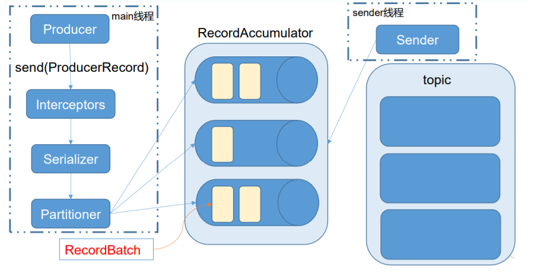
  - 生产者通过`send()`发送数据，依次经过拦截器、序列化器、分区器到达共享变量`RecordAccumulator`，再由`Sender`线程将消息从`RecordAccumulator`发送到kafka
  - 相关参数
    - `batch.size`：只有数据积累到`batch.size`之后，`sender`才会发送数据。 
    - `linger.ms`：如果数据迟迟未达到`batch.size`，`sender`等待`linger.time`之后就会发送数据。

- [异步发送]()
- [同步发送]()

#### Customer API

- Consumer消费数据的可靠性是很容易保证的，因为数据在Kafka中是持久化的，故不用担心数据丢失问题。
- 由于consumer在消费过程中可能会出现断电宕机等故障，consumer恢复后，需要从故障前的位置的继续消费，所以consumer需要实时记录自己消费到了哪个offset，以便故障恢复后继续消费。所以offset的维护是 Consumer消费数据是必须考虑的问题。
- `org.apache.kafka.clients.consumer.ConsumerConfig#AUTO_OFFSET_RESET_CONFIG`可用来重置offset
- [自动提交offset]()
- 手动提交
  - 虽然自动提交 offset 十分简介便利，但由于其是基于时间提交的，开发人员难以把握 offset 提交的时机。因此 Kafka 还提供了手动提交 offset 的 API。
  - 手动提交 offset 的方法有两种：分别是**commitSync（同步提交）**和**commitAsync（异步提交）**。两者的相同点是，都会将**本次 poll 的一批数据最高的偏移量提交**；不同点是， commitSync 阻塞当前线程，一直到提交成功，并且会自动失败重试（由不可控因素导致， 也会出现提交失败）；而 commitAsync 则没有失败重试机制，故有可能提交失败。
  - [同步提交]()
  - [异步提交]()
  - 无论是同步提交还是异步提交offset，都有可能会造成数据的漏消费或者重复消费。先提交offset后消费，有可能造成数据的漏消费；而先消费后提交offset，有可能会造成数据 的重复消费。
- Kafka 0.9版本之前，offset存储在zookeeper，0.9 版本及之后，默认将offset存储在Kafka的一个内置的 topic 中。除此之外，Kafka 还可以选择自定义存储 offset。offset 的维护是相当繁琐的，因为需要考虑到消费者的Rebalace。当有新的消费者加入消费者组、已有的消费者退出消费者组或者所订阅的主题的分区发生变化，就会触发到分区的重新分配，重新分配的过程叫做 Rebalance。消费者发生Rebalance之后，每个消费者消费的分区就会发生变化。因此消费者要首先获取到自己被重新分配到的分区，并且定位到每个分区最近提交的 offset 位置继续消费。自定义存储 offset可借助`ConsumerRebalanceListener`完成。

#### Interceptor

- Producer拦截器(interceptor)是在 Kafka 0.10 版本被引入的，主要用于实现 clients 端的定制化控制逻辑。

- 对于producer而言，interceptor使得用户在消息发送前以及producer回调逻辑前有机会对消息做一些定制化需求，比如修改消息等。同时，producer 允许用户指定多个interceptor按序作用于同一条消息从而形成一个拦截链(interceptor chain)。Intercetpor 的实现接口是 `org.apache.kafka.clients.producer.ProducerInterceptor`，其定义的方法包括：

  - `configure(configs)`

    获取配置信息和初始化数据时调用。

  - `onSend(ProducerRecord)`

    该方法封装进`KafkaProducer.send()`方法中，即它运行在用户主线程中。Producer 确保在消息被序列化以及计算分区前调用该方法。可以在该方法中对消息做任何操作，但最好保证不要修改消息所属的 topic 和分区，否则会影响目标分区的计算。

  - `onAcknowledgement(RecordMetadata, Exception)`

    该方法会在消息从`RecordAccumulator`成功发送到`Kafka Broker`之后，或者在发送过程中失败时调用。并且通常都是在 producer 回调逻辑触发之前。`onAcknowledgement`运行在 producer 的 IO 线程中，因此不要在该方法中放入很重的逻辑，否则会拖慢 producer 的消息发送效率。

  - `close`

    关闭 interceptor，主要用于执行一些资源清理工作，如前所述，interceptor 可能被运行在多个线程中，因此在具体实现时用户需要自行确保线程安全。另外倘若指定了多个 interceptor，则 producer 将按照指定顺序调用它们，并仅仅是捕获每个 interceptor 可能抛出的异常记录到错误日志中而非在向上传递。这在使用过程中要特别留意。

- [拦截器案例]()

  - 实现一个简单的双 interceptor 组成的拦截链。第一个 interceptor 会在消息发送前将时间 戳信息加到消息 value 的最前部；第二个 interceptor 会在消息发送后更新成功发送消息数或 失败发送消息数。

    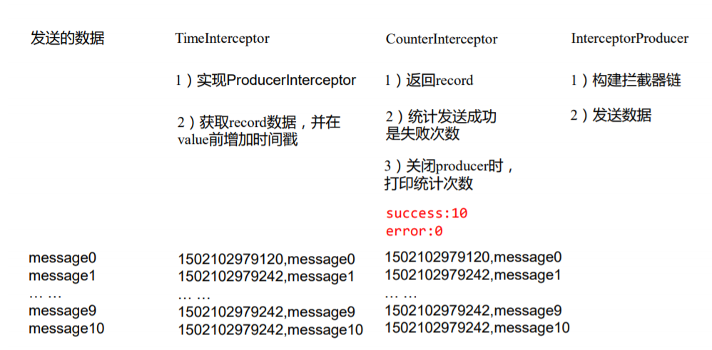

### Kafka监控

- Kafka Eagle是开源可视化和管理软件，提供了将kafka集群数据转换为可视化图形图表的工具。

- [kafka-eagle](https://www.kafka-eagle.org/)

- 使用步骤

  1. 修改kafka 启动命令（集群中所以节点都要修改），修改 kafka-server-start.sh 命令中

     ```shell
     if [ "x$KAFKA_HEAP_OPTS" = "x" ]; then
         export KAFKA_HEAP_OPTS="-Xmx1G -Xms1G"
     fi
     ```

     为

     ```shell
     if [ "x$KAFKA_HEAP_OPTS" = "x" ]; then
         export KAFKA_HEAP_OPTS="-server -Xms2G -Xmx2G -XX:PermSize=128m
     -XX:+UseG1GC -XX:MaxGCPauseMillis=200 -XX:ParallelGCThreads=8 -XX:ConcGCThreads=5 -XX:InitiatingHeapOccupancyPercent=70"
         export JMX_PORT="9999"
         #export KAFKA_HEAP_OPTS="-Xmx1G -Xms1G"
     fi
     ```

     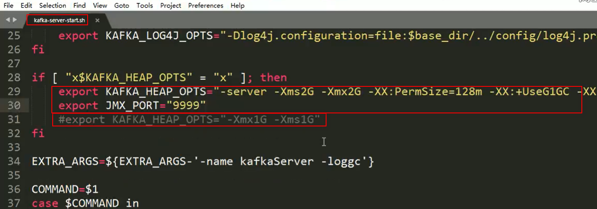

  2. 解压

     解压`kafka-eagle-bin-1.3.7.tar.gz`，再解压`kafka-eagle-web-1.3.7-bin.tar.gz`，将解压后的路径配置到环境变量中。

     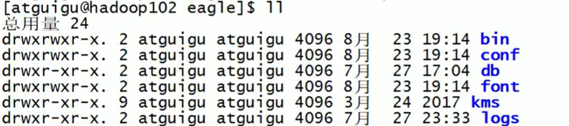

  3. 修改bin目录中启动脚本权限

     修改权限：`chmod 777 ke.sh `

  4. 修改配置文件

     修改`conf\system-config.properties`文件内容，如下：

     ```sh
     ######################################
     # multi zookeeper&kafka cluster list
     # eagle可以监控多套kafka集群，如下方式配置zk地址即可
     ######################################
     kafka.eagle.zk.cluster.alias=cluster1,cluster2
     cluster1.zk.list=localhost:2181
     cluster2.zk.list=ip:port
     
     ######################################
     # zk client thread limit
     ######################################
     kafka.zk.limit.size=25
     
     ######################################
     # kafka eagle webui port
     ######################################
     kafka.eagle.webui.port=8048
     
     ######################################
     # kafka offset storage
     # 配置存放offset的位置，旧版本存在zk中，新版本存在kafka中
     ######################################
     cluster1.kafka.eagle.offset.storage=kafka
     cluster2.kafka.eagle.offset.storage=zk
     
     ######################################
     # enable kafka metrics
     # 是否显示图标等
     ######################################
     kafka.eagle.metrics.charts=true
     kafka.eagle.sql.fix.error=false
     
     ######################################
     # kafka sql topic records max
     ######################################
     kafka.eagle.sql.topic.records.max=5000
     
     ######################################
     # alarm email configure
     # 异常是否发邮件通知
     ######################################
     kafka.eagle.mail.enable=false
     kafka.eagle.mail.sa=alert_sa@163.com
     kafka.eagle.mail.username=alert_sa@163.com
     kafka.eagle.mail.password=mqslimczkdqabbbh
     kafka.eagle.mail.server.host=smtp.163.com
     kafka.eagle.mail.server.port=25
     
     ######################################
     # alarm im configure
     ######################################
     #kafka.eagle.im.dingding.enable=true
     #kafka.eagle.im.dingding.url=https://oapi.dingtalk.com/robot/send?access_token=
     
     #kafka.eagle.im.wechat.enable=true
     #kafka.eagle.im.wechat.token=https://qyapi.weixin.qq.com/cgi-bin/gettoken?corpid=xxx&corpsecret=xxx
     #kafka.eagle.im.wechat.url=https://qyapi.weixin.qq.com/cgi-bin/message/send?access_token=
     #kafka.eagle.im.wechat.touser=
     #kafka.eagle.im.wechat.toparty=
     #kafka.eagle.im.wechat.totag=
     #kafka.eagle.im.wechat.agentid=
     
     ######################################
     # delete kafka topic token
     ######################################
     kafka.eagle.topic.token=keadmin
     
     ######################################
     # kafka sasl authenticate
     ######################################
     cluster1.kafka.eagle.sasl.enable=false
     cluster1.kafka.eagle.sasl.protocol=SASL_PLAINTEXT
     cluster1.kafka.eagle.sasl.mechanism=PLAIN
     cluster1.kafka.eagle.sasl.jaas.config=org.apache.kafka.common.security.plain.PlainLoginModule required username="admin" password="kafka-eagle";
     
     #cluster2.kafka.eagle.sasl.enable=false
     #cluster2.kafka.eagle.sasl.protocol=SASL_PLAINTEXT
     #cluster2.kafka.eagle.sasl.mechanism=PLAIN
     #cluster2.kafka.eagle.sasl.jaas.config=org.apache.kafka.common.security.plain.PlainLoginModule required username="admin" password="kafka-eagle";
     
     ######################################
     # kafka jdbc driver address
     ######################################
     kafka.eagle.driver=com.mysql.jdbc.Driver
     kafka.eagle.url=jdbc:mysql://localhost:3306/ke?useUnicode=true&characterEncoding=UTF-8&zeroDateTimeBehavior=convertToNull
     kafka.eagle.username=root
     kafka.eagle.password=root
     ```

  5. 启动zk，kafka，启动kafka时需设置`JMX_PORT`：

     `JMX_PORT=9999 bin/kafka-server-start.sh config/server.properties &`

  6. 启动eagle并访问`bin/ke.sh start`

     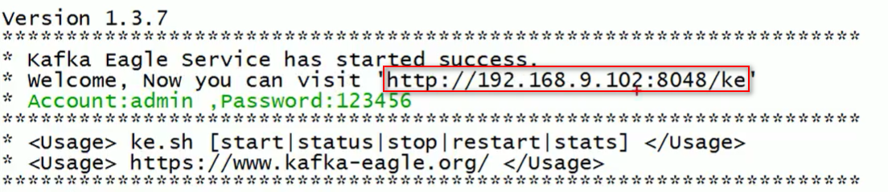

  7. 效果

     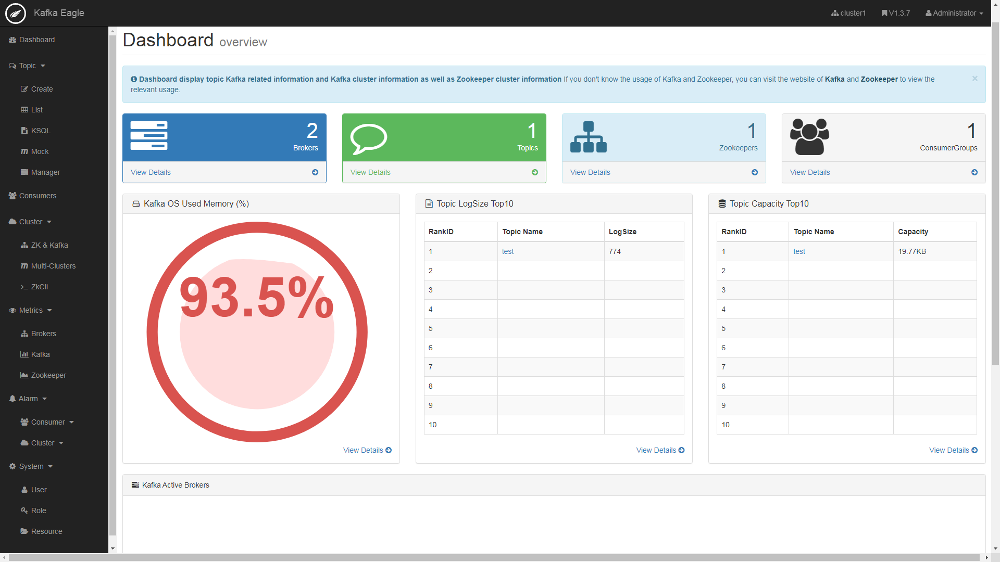


### 常见问题

1. Kafka 中的 ISR(InSyncRepli)、OSR(OutSyncRepli)、AR(AllRepli)代表什么

   ISR：在`replica.lag.time.max.ms`参数指定的时间内从leader同步数据的follower

   AR：所有的follower

   OSR：AR - ISR

2. Kafka中是怎么体现消息顺序性的？

   每个分区内,每条消息都有offset,所以只能在同一分区内有序,但不同的分区无法做到消息顺序性

3. “消费组中的消费者个数如果超过topic的分区，那么就会有消费者消费不到数据”这句话是否正确?

   对的,超过分区数的消费者就不会再接收数据

4. 有哪些情形会造成重复消费？或丢失信息？

   先处理后提交offset,会造成重读消费
   先提交offset后处理,会造成数据丢失

5. Kafka 分区的目的？

   对于kafka集群来说,分区可以做到负载均衡

   对于消费者来说,可以提高并发度,提高读取效率

6. Kafka 的高可靠性是怎么实现的？

   ISR、ACK机制

7. topic的分区数可不可以增加？如果可以怎么增加？如果不可以，那又是为什么？

   `bin/kafka-topics.sh --zookeeper localhost:2181/kafka --alter --topic topic-config --partitions 3`

8. topic的分区数可不可以减少？如果可以怎么减少？如果不可以，那又是为什么？

   不可以,先有的分区数据难以处理

9. 简述Kafka的日志目录结构？

   每一个分区对应一个文件夹,命名为topic-0,topic-1,每个文件夹内有.index和.log文件

10. Kafka的那些设计让它有如此高的性能？

    kafka是分布式的消息队列

    对log文件进行了segment,并对segment建立了索引

    (对于单节点)使用了顺序读写,速度可以达到600M/s

    引用了zero拷贝,在os系统就完成了读写操作

11. kafka启动不起来的原因?

    在关闭kafka时,先关了zookeeper,就会导致kafka下一次启动时,会报节点已存在的错误
    只要把zookeeper中的zkdata/version-2的文件夹删除即可

12. 聊一聊Kafka Controller的作用？

    负责kafka集群的上下线工作,所有topic的副本分区分配和选举leader工作

13. Kafka中有那些地方需要选举？这些地方的选举策略又有哪些？

    在ISR中需要选举leader

14. 失效副本是指什么？有那些应对措施？

    失效副本为速率比leader相差大于10秒的follower
    将失效的follower先提出ISR
    等速率接近leader10秒内,再加进ISR

15. Kafka消息是采用Pull模式，还是Push模式？

    在producer阶段,向broker用Push模式
    在consumer阶段,向broker用Pull模式
    在Pull模式下,consumer可以根据自身速率选择如何拉取数据,避免了低速率的consumer发生崩溃的问题
    但缺点是,consumer要时不时的去询问broker是否有新数据,容易发生死循环,内存溢出

16. Kafka创建Topic时如何将分区放置到不同的Broker中？

    首先副本数不能超过broker数
    第一分区是随机从Broker中选择一个,然后其他分区相对于0号分区依次向后移
    第一个分区是从nextReplicaShift决定的,而这个数也是随机产生的

17. Kafka中的事务是怎么实现的?

    kafka事务有两种
    producer事务和consumer事务
    producer事务是为了解决kafka跨分区跨会话问题
    kafka不能跨分区跨会话的主要问题是每次启动的producer的PID都是系统随机给的
    所以为了解决这个问题，我们就要手动给producer一个全局唯一的id,也就是transaction id 简称TID
    我们将TID和PID进行绑定,在producer带着TID和PID第一次向broker注册时,broker就会记录TID,并生成一个新的组件__transaction_state用来保存TID的事务状态信息
    当producer重启后,就会带着TID和新的PID向broker发起请求,当发现TID一致时
    producer就会获取之前的PID,将覆盖掉新的PID,并获取上一次的事务状态信息,从而继续上次工作
    consumer事务相对于producer事务就弱一点,需要先确保consumer的消费和提交位置为一致且具有事务功能,才能保证数据的完整,不然会造成数据的丢失或重复

18. Kafka中的分区器、序列化器、拦截器是否了解？它们之间的处理顺序是什么？

    拦截器>序列化器>分区器

19. Kafka生产者客户端的整体结构是什么样子的？使用了几个线程来处理？分别是什么？

    

    使用两个线程:
    main线程和sender线程
    main线程会依次经过拦截器,序列化器,分区器将数据发送到RecourdAccumlator(线程共享变量)
    再由sender线程从RecourdAccumlator中拉取数据发送到kafka broker
    相关参数：
    batch.size：只有数据积累到batch.size之后，sender才会发送数据。
    linger.ms：如果数据迟迟未达到batch.size，sender等待linger.time之后就会发送数据。

20. 消费者提交消费位移时提交的是当前消费到的最新消息的offset还是offset+1？

    `offset + 1`，生产者发送数据offset是从0开始的

21. kafka有内部topic吗？有什么作用

    有，存offset

22. kafka消息数据积压，消费能力不足怎么处理

    如果是kafka消费能力不足，可以考虑增加topic的分区数，并且同时提升消费者组消费者的数量，消费者数=分区数(两者缺一不可，因为如果消费者数多于分区数，那么多余的消费者消费不到数据)

    如果是下游数据处理不及时，提供每批次拉取的数量，批次拉取数据过少(拉取数据 / 处理时间 < 生产速度)，也会造成数据积压  

